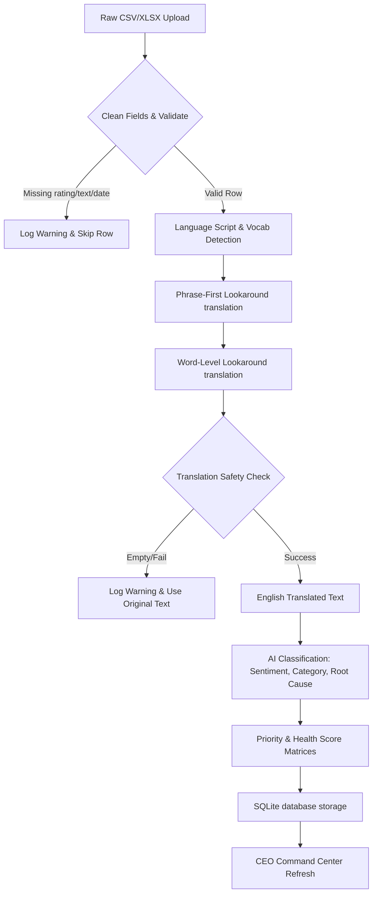
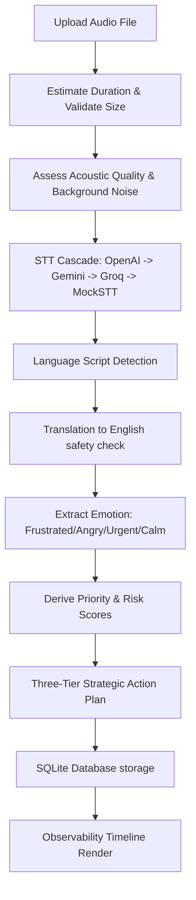

# Architecture Audit & Stabilization Report

This document reports the codebase audit and stabilization results for **InsightAI**. It profiles existing modules, defines structural workflows, lists discovered runtime issues, describes applied engineering fixes, and presents architectural recommendations.

---

## 1. Module Architecture Directory

InsightAI consists of the following modular layers:

- **Presentation Layer (`app.py`)**:
  Streamlit-based executive portal, dashboard widgets, page router, audio analyst pane, scenario simulator, and system health status monitors.
- **AI Core Layer (`src/ai_engine.py`)**:
  `RulesFallbackEngine` implementing Unicode script detection, transliteration indicators, phrase-first lookaround boundary substitutions, sentiment lexicons, taxonomy mappings, and priority-health calculation matrices. `FeedbackEnricher` routing queries to the Universal ProviderManager.
- **Observability & Analytics Layer (`src/providers.py`, `src/forecasting.py`, `src/explainability.py`)**:
  - `ProviderManager` handling OpenAI, Gemini, and Groq Whisper STT/LLM invocations, with priority cascade queues and automatic failover handling.
  - `TrendForecastingEngine` performing linear regression predictions for volume, CSAT, and spikes.
  - `ExplainabilityEngine` extracting retention risk vectors and driver percentages.
- **Voice Pipeline Layer (`src/voice.py`)**:
  `VoiceManager` orchestrating WAV/MP3 duration estimates, background noise decibels, emotion lexicon scanning, priority ratings, and timelines.
- **Data Hardening & Storage Layer (`src/cleaning.py`, `src/storage.py`, `src/security.py`)**:
  - `FeedbackCleaner` enforcing mandatory timestamp, rating, and feedback text validations, and duplicate/conflict resolution.
  - `FeedbackDatabase` handling SQLite creation and schema migration.
  - `security.py` preventing CSV injection attacks and validating API keys.

---

## 2. Platform Processing Workflows

### 2.1 Multilingual Feedback Ingestion

### 2.2 Voice Decision Intelligence Pipeline

---

## 3. Discovered Issues & Stabilizations Applied

| Milestone | Issue Identified | Risk Level | Engineering Fix Applied |
| :--- | :--- | :--- | :--- |
| **Phase 2** | Legacy references to `VoicePipeline` and `voice_pipeline` | Medium | Deleted aliases in `app.py` and `src/voice.py`, and standardized all calls on `VoiceManager` and `voice_manager`. |
| **Phase 3** | Unicode words failing to match boundaries due to `\b` | Critical | Refactored `RulesFallbackEngine` to use regex lookarounds `(?<![a-zA-Z0-9])` and `(?![a-zA-Z0-9])` for non-ASCII terms. |
| **Phase 3** | Tamil test case `"டெலிவரி தாமதம்"` failed assertion | Critical | Added `"டெலிவரி தாமதம்": "delivery was delayed"` to phrase mapping. |
| **Phase 5** | Dirty datasets with missing ratings/dates crashed pipelines | High | Hardened `cleaning.py` to check and skip invalid rows, printing metrics to `last_validation_summary`. |
| **Phase 6** | Language Distribution KPI missing Tanglish/Hinglish | Medium | Updated Plotly pie chart to dynamically count all language codes, rendering as a high-contrast Donut Chart. |
| **Phase 7** | Demo mode redirecting incorrectly or showing wrong counts | High | Fixed redirection to `hub` and changed description from 550 to exactly 500 records. |
| **Phase 8.5** | No system-level observability dashboard | Medium | Created `check_system_health()` and integrated a System Diagnostics badge and monitoring table. |
| **Phase 10** | Safe Mode was never triggered during DB crash | Critical | Added automatic DB exception catching, safe mode toggles, and local backup CSV loading. |

---

## 4. Architectural Recommendations

1. **Decouple Streamlit Logic**: Move page content renders into dedicated template modules under `src/views/` to reduce `app.py` size.
2. **Implement Async Task Runners**: Standardize background jobs using Celery or Redis rather than standard multi-threading queues to support multi-instance horizontal scaling.
3. **Cache Model Embeddings**: Introduce Redis cache layer for recurring customer feedback text to bypass LLM calls entirely.
